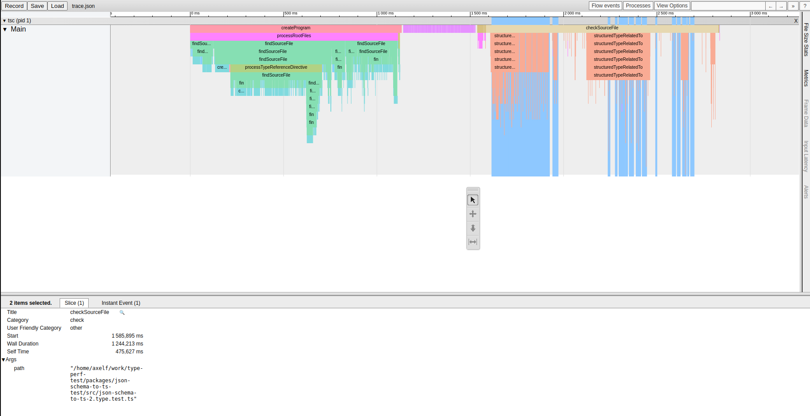
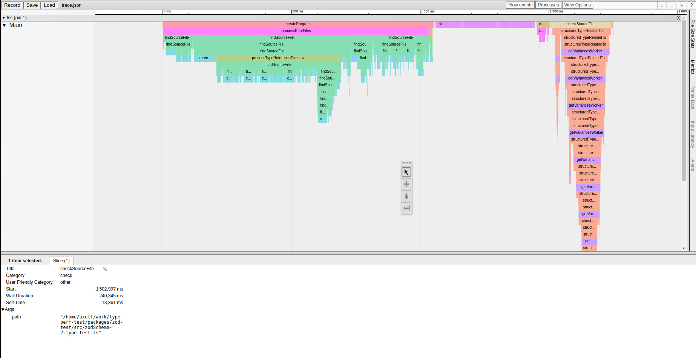

# Results

This repository was create to compare the type inference performance of js-schema-to-ts and zod in a swarmion context, in order to chose if we wanted to implement zod contracts for swarmion serverless-contracts.

For that, we created a similar schema using both technologies and created other packages to run test types based on the inference of those schema. We observed the following tracing results:

json-schema-to-ts ([raw tracing file](./results/json-schema-to-ts-trace.json))

zod ([raw tracing file](./results/zod-trace.json))

The important metric is wall duration. We see that it goes from 1.2s for `json-schema-to-ts` to 0.2 for `zod`. This is a 6x improvement.

## Swarmion

This template is an example of a project generated with [Swarmion](https://www.swarmion.dev)

## Commands

These commands have to be run at the root of the project.

- `nvm use`: set the version of node set in `.nvmrc`
- `pnpm install`: install node dependencies in all packages;
- `pnpm package`: compile the common packages;
- `pnpm test`: launch the tests in all packages;
- `pnpm run deploy`: deploy all the end services in order;
- `pnpm generate-service myService`: create a simple service in the repository's structure respecting our guidelines
- `pnpm generate-library myLibrary`: create a simple internal library in the repository's structure respecting our guidelines
